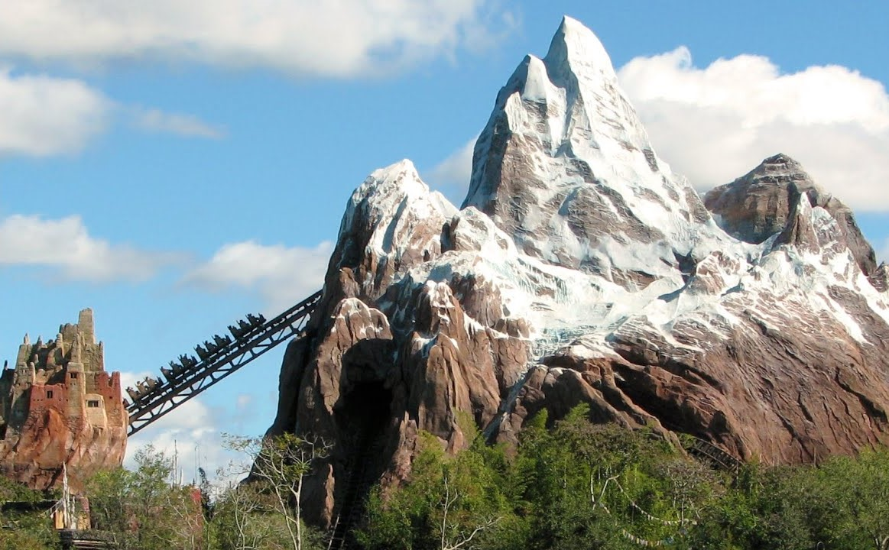

```{r setup, include=FALSE}
knitr::opts_chunk$set(echo = TRUE)
```

## Introduction

Walt Disney World in Orlando, Florida USA is a theme park resort owned and operated by the Walt Disney Company.  Consisting of four major theme parks and 34 resorts and hotels on property, Walt Disney World has over 58 million visitors per year. 

Expedition Everest (full name "Expedition Everest - Legend of the Forbidden Mountain") is a high speed steel roller coaster thriller attraction (ride) at Walt Disney World's Animal Kingdom that takes guests through simulated Himilaya mountains while encountering a feared Yeti creature.  Expedition Everest was built in 2006 and is reported to be the most expensive roller coaster ever built at an estimated cost of $100 million USD. The attraction experience takes three minutes and covers over 4,000 feet of track with the coasters reaching speeds of 50 miles per hour. It is one of the more popular attractions at Animal Kingdom theme park. 

Expedition Everest attraction wait time data are used as the basis of this project with the goal of using machine learning to determine a method of predicting accurate wait times. 



## Obtaining the Data Set and Data Prep

TourinngPlans.com is a company founded by Len Testa about 20 years ago as a school project to minimize wait times at Disney theme parks.  Len collected data and write the first algorithms to optimize the theme park experience.  The company currently offers custom tour plan subscriptions to Disney and Universal theme parks as well as Disney Cruise lines and Washington DC and has over 140,000 subscribers.   

Theme park attraction wait times since 2012 have been made available for key attractions at the TouringPlans.com website and consist of a rich data set of actual measured attraction wait times along with an extensive "meta data" set of ancillary information (e.g. theme park open and close times, day of week, time of year, etc.)

After downloaing the files, I merged the Expedition Everest actual wait time data (discarding the "posted" wait time data) and merged it with the daily metadata based on the DATE field. I then cleaned the data by removing missing rows of data, cleaning date/time fields, and removing columns that had data specific to other Walt Disney World theme parks (i.e. Magic Kingdom, Epcot, and Hollywood Studios) but kept all the Animal Kingdom data.  I also simplifed the data set by removing columns pertaining to regional school district hollidays and removing columns with non-binary categorical data.  The final data file (named EverestData) is a compact 1.2MB file with 29 variables and 6940 observations. 

```{r Load Packages and Data, echo=FALSE, message=FALSE}

# Load needed packages
library(dslabs)
library(dplyr)
library(tidyverse)
library(caret)
library(lubridate)

# Load Everest Data file
# Data files are stored locally
# lubridate used to make date and time data uniform
EverestData <- read.csv("https://raw.githubusercontent.com/schenx/Disney/master/Everest_Data_Small.csv")
EverestData$DATE <- lubridate::mdy(EverestData$DATE)
EverestData$Time <- lubridate::hm(EverestData$Time)

# Create a "TimeHour" field which converts time of day from HH:MM to Hours in decimals
EverestData <- EverestData %>% mutate(TimeHour = (as.numeric(EverestData$Time))/3600)
```

## Data Exploration and Visualzation

The EverestData file consists of 29 variables with 6940 observations. A few basic summary statistics are provided here:

```{r summary, echo=FALSE, message=FALSE, warning=FALSE}

# Summary Statistics
ev_mean <- mean(EverestData$Wait_Time)
Summary_Stats <- data_frame( Stat = "Mean", Value = ev_mean)

ev_median <- median(EverestData$Wait_Time)
Summary_Stats <- bind_rows(Summary_Stats, data_frame(Stat = "Median", Value = ev_median))

ev_sd <- sd(EverestData$Wait_Time)
Summary_Stats <- bind_rows(Summary_Stats, data_frame(Stat = "SD", Value = ev_sd))

ev_min <- min(EverestData$Wait_Time)
Summary_Stats <- bind_rows(Summary_Stats, data_frame(Stat = "Min", Value = ev_min))

ev_max <- max(EverestData$Wait_Time)
Summary_Stats <- bind_rows(Summary_Stats, data_frame(Stat = "Max", Value = ev_max))

print("Wait Time Summary Statistics")
Summary_Stats

print ("Wait Time Quantile")
ev_quantile <- quantile(EverestData$Wait_Time)
ev_quantile
```

It is interesting to see that the standard deviation is quite close ot the mean wait time. This indicates a relatively broad distribution of wait times at the attraction.  

Visualizing the datat will make this more apparent.

```{r histogram, echo=FALSE}
# Histogram of Wait Times
ggplot(EverestData, aes(Wait_Time)) + geom_histogram(binwidth=5, fill="tomato3") +
  labs(title="Expedition Everest Wait Time Histogram (binwidth = 5min)")
```

From the historgram we see a large number of short wait times with a long right hand tail that goes to 114 minutes.  While a popular ride, wait times appear to be relatively short.

```{r Month of Year, echo=FALSE, message=FALSE}

# Average Wait Time by Month of Year
Month_Avg <- EverestData %>% group_by(MONTHOFYEAR) %>% summarize(Avg_Wait = mean(Wait_Time))
ggplot(Month_Avg, aes(x=MONTHOFYEAR, y=Avg_Wait)) + geom_bar(stat="identity", width=.5, fill="tomato3") +
  labs(title="Expedition Everest Average Wait Time by Month")
``` 

```{r Daily Avg Wait by Date, echo=FALSE, results='hide'}

# Find Daily Averages and Sort
Day_Avg <- EverestData %>% group_by(DATE) %>% summarize(Day_Avg_Wait = mean(Wait_Time)) 
dplyr::arrange(Day_Avg, DATE)
```

```{r Plot Daily Avg Wait by Date, echo=FALSE}

# Plot Daily Averages
ggplot(Day_Avg, aes(x=DATE, y=Day_Avg_Wait)) + geom_line() + geom_smooth(method = "lm", color="tomato3") +
  labs(title = "Expedition Everest Daily Average Wait Time by Date")
```

Plots of average wait time by month and wait time by day indicate there is some sort of seasonality happening.  Longest wait times occur around March (possibly due to Spring Break holiday) as well as the November and December timeframe (possibly Thanksgiving and Christmas holidays?) The lowest average wait occurs in the month of September.  The average wait time by date plot shows us how "spiky" the data can be with variations within a day.  The trend appears to be for the wait times to be increasing over time. 

```{r Day of Week, echo=FALSE}
# Average Wait Time by Day of Week
DoW_Avg <- EverestData %>% group_by(DAYOFWEEK) %>% summarize(Avg_Wait = mean(Wait_Time))
ggplot(DoW_Avg, aes(x=DAYOFWEEK, y=Avg_Wait)) + geom_bar(stat="identity", width=.5, fill="tomato3") +
  labs(title="Expedition Everest Average Wait Time by Day of Week")
```

Plotting average wait times by day of week clearly show higher wait times on the weekends and Fridays with lower wait times Monday through Thursday. 

```{r Time of Day, echo=FALSE}
# Wait Time during Time of Day
ggplot(EverestData, aes(x=TimeHour, y=Wait_Time)) + geom_point(color="tomato3") +
  labs(title = "Expedition Everest Wait Time During Time of Day (in Seconds)")
```

Finally, plotting wait times against the time of day clearly show a Gaussian (bell) distribution with an increase in times towards the begining of the day and and decrease in the evening hours. 

From the visuals, it appears riding Expedition Everest in the month of September, on a Monday - Thursday, either early morning or late evening would result in the shortest wait times. But can we actually use machine learning to predict this? Are there other factors that would influence wait time?

## Machine Language Approaches

Before applying machine language approaches to fit the datat, training and testing (validation) data sets were created from the EverestData.  A partition was used so 20% of the data was in validation set while the remainder was in the training (Everest_Train) set. 20% was chosen to speed the training algorithms. Finally, Root Mean Squared Error is chosen as an accuracy measure so that is coded as well. 

Once that was done, an array of machine language approaches was applied to the data.

```{r Create Test and Validation, echo=FALSE}

# Create Validation and Test Sets
set.seed(1) 
test_index <- createDataPartition(y = EverestData$Wait_Time, times = 1, p = 0.1, list = FALSE)
Everest_Train <- EverestData[-test_index,]
validation <- EverestData[test_index,]
rm(test_index)
```

```{r RMSE, echo=FALSE}

# Code the Root Mean Square Error function
RMSE <- function(true_ratings, predicted_ratings){
  sqrt(mean((true_ratings - predicted_ratings)^2))
}

```

For reference, a "Naive" model is used to determine a baseline for improvement.  The naive model uses the average wait time as the prediction variable

```{r Naive, echo=FALSE}

# Naive Approach
mu_hat <- mean(EverestData$Wait_Time)
naive_rmse <- RMSE(validation$Wait_Time, mu_hat)
rmse_results <- data_frame(method = "Naive Approach", RMSE = naive_rmse)
rmse_results
```

Not surprisingly, the RMSE is quite large given the distrbution of the data. 

## Linear Regression Model Approach Results

A simple linear regression model was created using factors such as DAYOFWEEK, DAYOFYEAR, TimeHour, etc. as used in the visualzations. 

```{r Linear, echo=FALSE, warning=FALSE}

# Linear Model Approach
fit <- lm(Wait_Time ~ DAYOFWEEK + DAYOFYEAR + WEEKOFYEAR + MONTHOFYEAR
          + AKEMHMORN + AKEMHEVE + AKHOURSEMH + AKHOURS + TimeHour, data = Everest_Train)
y_hat <- predict(fit, validation)
linear_rmse <- RMSE(validation$Wait_Time, y_hat)
rmse_results <- bind_rows(rmse_results, data_frame(method = "Linear Model Approach", RMSE = linear_rmse))
rmse_results
```

The linear approach improved the predictive power of the model slightly.  

## K Nearest Neighbor Approach Results

A K Nearest Neighbor model was created using the Caret package. 

```{r KNN, echo=FALSE, warning=FALSE}

train_knn <- train(Wait_Time ~., method="knn", data=Everest_Train)
y_hat_knn <- predict(train_knn, validation, type="raw")
knn_rmse <- RMSE(validation$Wait_Time, y_hat_knn)
rmse_results <- bind_rows(rmse_results, data_frame(method = "K Nearest Neighbor Approach",
                                                   RMSE = knn_rmse))
rmse_results
```

KNN improved the RMSE by almost 1.2 minutes. 

## Regression Tree Approach Results

A K Nearest Neighbor model was created using the Caret package. 

```{r Regression Tree, echo=FALSE, warning=FALSE}

# Regression Trees Approach
train_rpart <- train(Wait_Time ~., method="rpart",
                     tuneGrid = data.frame(cp = seq(0, 0.05, len = 25)),data=Everest_Train)
y_hat_rpart <- predict(train_rpart, validation, type="raw")
rpart_rmse <- RMSE(validation$Wait_Time, y_hat_rpart)
rmse_results <- bind_rows(rmse_results, data_frame(method = "Regression Trees Approach",
                                                 RMSE = rpart_rmse))
rmse_results
```

Regression Tree improved the RMSE slightly. 

## Random Forest Approach Results

The randomForest package is used to apply a random forest algorithm to the data. 

```{r Random Forest, echo=FALSE, warning=FALSE, message=FALSE}

# Random Forest Approach
library(randomForest)

train_rf <- randomForest(Wait_Time ~., data=Everest_Train)
y_hat_rf <- predict(train_rf, validation, type="response")
rf_rmse <- RMSE(validation$Wait_Time, y_hat_rpart)
rmse_results <- bind_rows(rmse_results, data_frame(method = "Random Forest Approach",
                                                   RMSE = rpart_rmse))
rmse_results
```

There is no improvement in RMSE with Random Forest approach over Regression Tree.  Perhaps the Regression Tree is already optimized? Running a variable importance plot shows that time of day (Time Hour) is the most important variable by far.


```{r Random Forest VarImp, echo=FALSE, warning=FALSE, message=FALSE}

# Plot of Random Forest Variable Importance
# Plot of Random Forest Variable Importance
varImpPlot(train_rf, type=2)
```

## Ensemble Approach Results

Finally, and ensemble approach averaging KNN and Random Forest was applied to the data. 

```{r Ensemble, echo=FALSE, warning=FALSE}

# Ensemble (KNN and Random Forest) Approach
y_hat <- (y_hat_rf + y_hat_knn)/2
ensemble_rmse <- RMSE(validation$Wait_Time, y_hat)

rmse_results <- bind_rows(rmse_results, data_frame(method = "Ensemble (KNN + Random Forest) Approach",
                                                  RMSE = ensemble_rmse))
rmse_results
```

This led to an improvement in the RMSE reducing RMSE to 10.6 minutes. 

## Conclusions

Using a KNN and Random Forest ensemble approach resulted in the smallest RMSE wait time prediction model with a RMSE of 10.6 minutes.  While an improvement of 3.3 minutes over the Naive model is a 24% improvement, it still seems relatively large.  In the future it would be good to include the categorical data (converting to binrary or other numerical values), data from other attractions, as well as data from other theme parks to see if this has an impact on the Expedition Everest wait times. What's not clear is how to acutally use the model to actually predict lower times.  Perhaps this can be determined by applying the fitted model to some test data to see what the predicted wait times would be. 

## References

Reference materials for this project.

Touring Plans website - https://touringplans.com/

Touring Plan dataset - https://touringplans.com/walt-disney-world/crowd-calendar#DataSets

Business Insider Interview with Len Testa and Touringplans.com - https://www.businessinsider.com/touringplans-disney-world-len-testa-interview-2019-5

